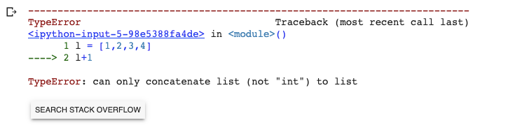

# Numpy Notes
## Quick Start
This is summarized from [Numpy Quick Start](https://numpy.org/devdocs/user/quickstart.html).

Before we start , we may have the question: why numpy? The similar data structure is List.
The following items are summarized from [the geeksforgeeks article](https://www.geeksforgeeks.org/python-lists-vs-numpy-arrays/).
* **List**: A list is a collection which is ordered and changeable. In Python, lists are written with square brackets.
           * The list can be homogeneous or heterogeneous.
           * Element wise operation is not possible on the list
           * Python list is by default 1 dimensional. But we can create an N-Dimensional list. But then too it will be 1 D list storing another 1D list
           * Elements of a list need not be contiguous in memory.
* **Numpy**: 
          * Array are by default Homogeneous, which means data inside an array must be of the same Datatype. 
          * Element wise operation is possible
          * Numpy array has the various function, methods, and variables, to ease our task of matrix computation.
          * Elements of an array are stored contiguously in memory.
* Advantages of using Numpy Arrays Over Python Lists:
          * consumes less memory.
          * fast as compared to the python List.
          * convenient to use.

```python
import numpy as np
l = [1,2,3]
np.array(l)
```
```
array([1, 2, 3, 4])
```
```python 
l = [1,2,3,4]
l+1
```

```python
l = [1,2,3,4]
np.array(l) + 1
```
```
array([2, 3, 4, 5])
```
```python 
l = ['a',1,2,3]
np.array(l)
```
```
array(['a', '1', '2', '3'], dtype='<U1')
```
## Create Numpy 
Create numpy from List. 
```
a=np.array([1,2,3,4])
print(a)
print(a.ndim)
print(a.shape)
```
```
[1 2 3 4]
1
(4,)
```
Multi-dimension array:
```python
a=np.array([[1,2,3],[4,5,6],[7,8,9]])
print(a)
print(a.shape)
print(a.ndim)
```
```
[[1 2 3]
 [4 5 6]
 [7 8 9]]
(3, 3)
2
```
Functions to create special np array.
```
a=np.arange(10)
print(a)
b=np.arange(1,100,20)
print(b)
print(np.linspace(0, 1, 6))
print(np.ones((3, 3)))
print(np.zeros((2, 2)))
print(np.eye(3))
```
```
[0 1 2 3 4 5 6 7 8 9]
[ 1 21 41 61 81]
[0.  0.2 0.4 0.6 0.8 1. ]
[[1. 1. 1.]
 [1. 1. 1.]
 [1. 1. 1.]]
[[0. 0.]
 [0. 0.]]
[[1. 0. 0.]
 [0. 1. 0.]
 [0. 0. 1.]]
```
